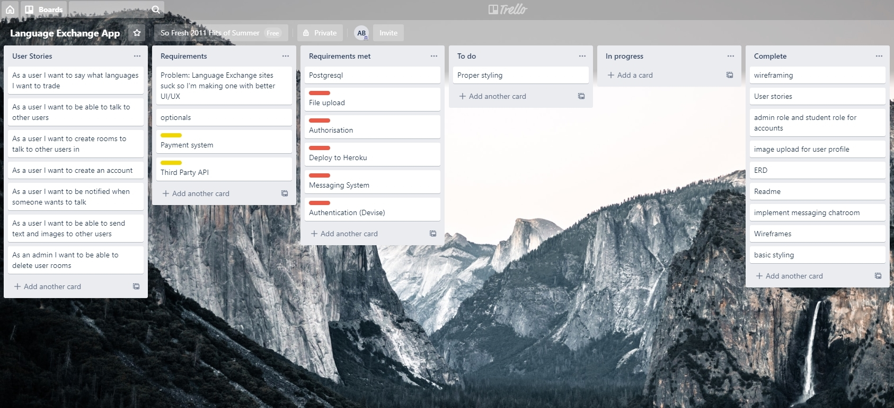
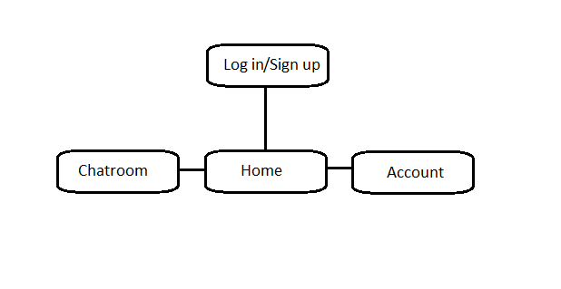
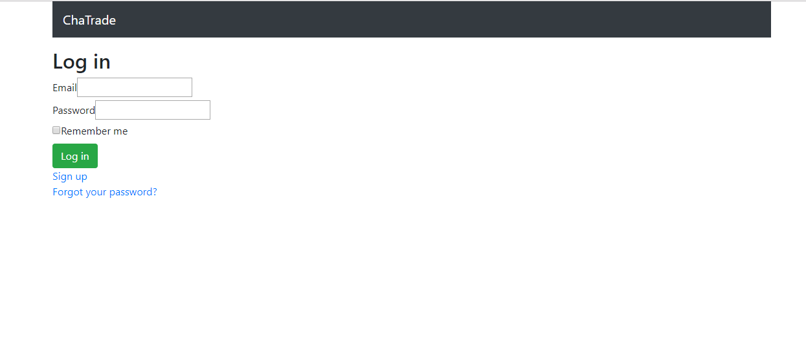
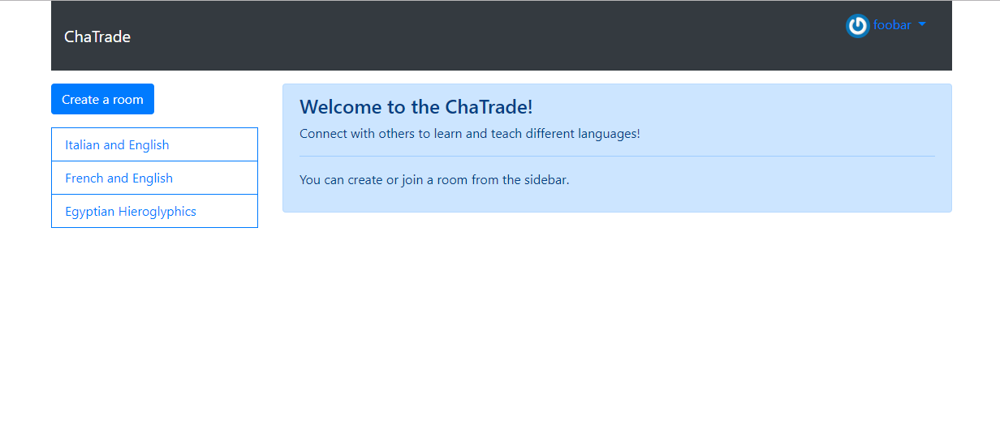
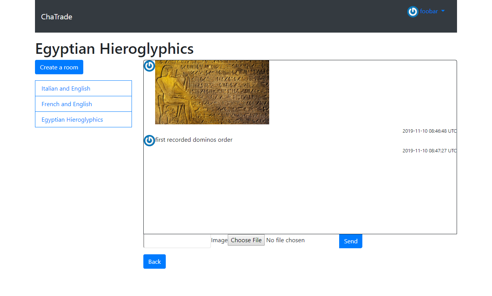
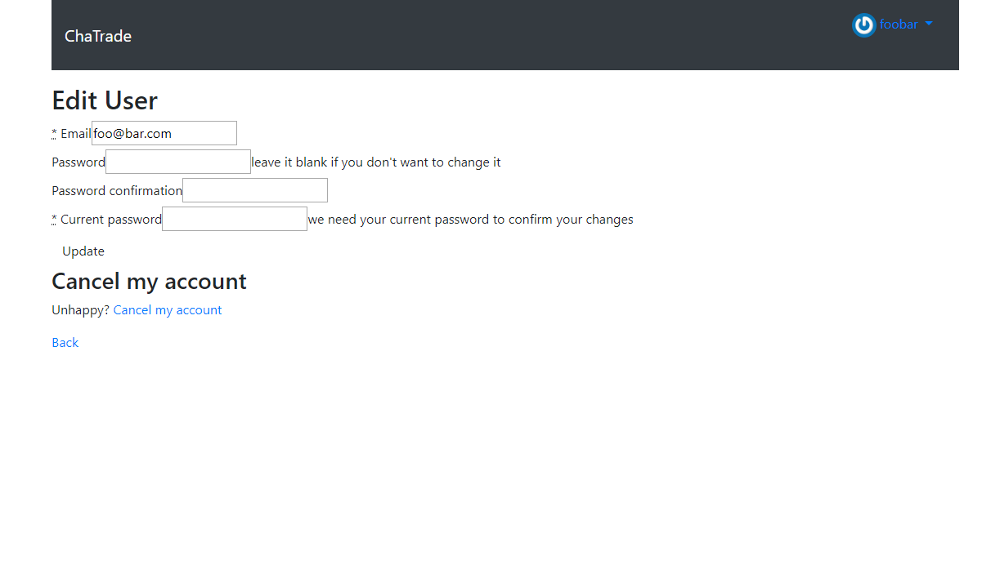
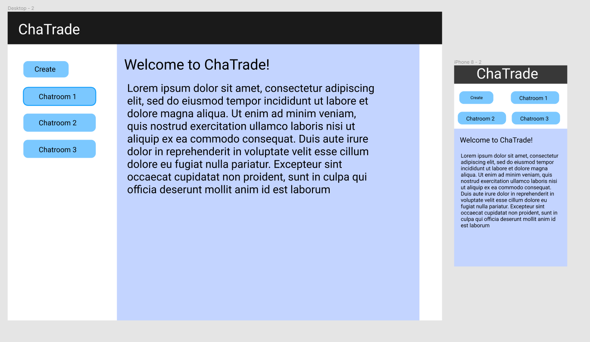
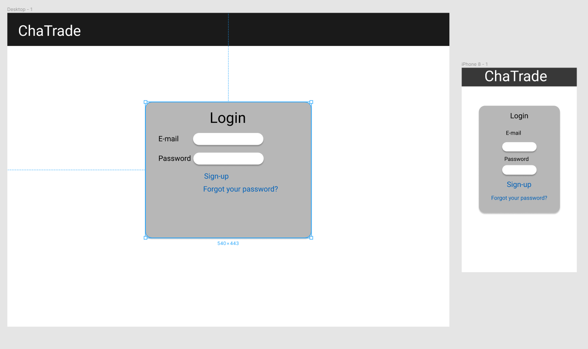
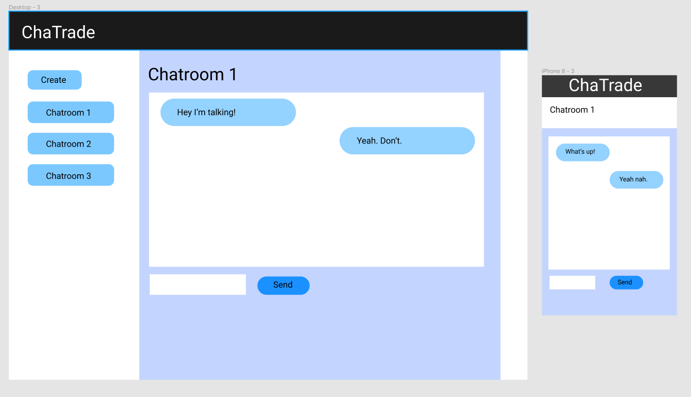
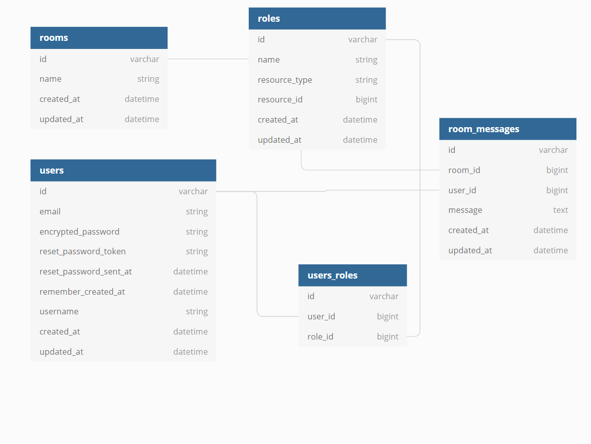

# ChaTrade

## Purpose

The purpose of ChaTrade is to connect registered users to one another via chat rooms so they can practice speaking different languages with each other. The idea being that if person A is a native English speaker and wants to practice his Japanese, person B who is a native Japanese can practice their english with them at the same time. The site isn't particularly well suited for teaching absolute beginners but rather for intermediates to practice what they've learned previously with native speakers of their desired language.

There already exists a couple apps that have similar functionality to this one but they lack appropriate UI and UX making it more difficult than needed to get into the language experience. I believe that the faster you can get a user engaged and involved the better.

## Functionality

This app allows users to create and manage their own accounts as well allow users to create different chat rooms different languages and combinations of said languages. Any user can create a room where they can list the languages they're trading or join an existing room with those desired languages. Users can also upload their own user profile picture to personalize their profile a little more to their liking.

## Planning

I brainstormed and planned the project prior to beginning using Trello and good old fashioned pen and paper. Afterwards I put the drawn out ideas into both Figma and lucid chart to get a cleaner representation of my ideas. I used Trello to list user stories and steps needed to to fulfil those user stories. Over the course of the project I utilized Trello to keep on track of what part of the project needed to be worked on and prevent myself from branching out into unrelated tasks and allowing feature creep to happen (which occasionally happened regardless).

Trello was very useful overall.

This screenshot also includes the user stories.

## Sitemap

## Screenshots

## Wireframes

## ERD

## Target Audience 

The audience this app will be targeting is people who are interested in learning another language whether that be for educational purposes or for recreational purposes. The age range of these people could be anything from children to elderly, the interests of languages and learning them isn't limited by age, race or location.

## Tech Stack

The tech stack used is HTML, CSS, Ruby, Javascript and JQuery.

### Gem List

The gems of note I used are:
1. Simple form
2. Bootstrap
3. sass-rails
4. jquery-rails
5. cloudinary